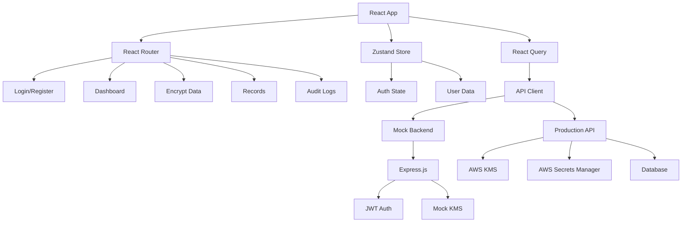

# EndCrypt - FinTech Encryption Platform

A production-ready React 18 + TypeScript frontend for a FinTech encryption application with AWS KMS integration, featuring end-to-end encryption workflows and comprehensive security measures.


## 🚀 Features

- **Modern Tech Stack**: React 18, TypeScript, Vite, TailwindCSS
- **Authentication**: JWT-based auth with secure token management
- **Encryption/Decryption**: AWS KMS integration for financial data security
- **Real-time UI**: Responsive design with dark theme and loading states
- **State Management**: Zustand for lightweight, type-safe state
- **API Integration**: React Query for server state with caching
- **Accessibility**: WCAG 2.1 AA compliant with keyboard navigation
- **Testing**: Unit tests (Vitest) and E2E tests (Playwright)
- **PWA Support**: Service worker and offline capabilities
- **CI/CD**: GitHub Actions with automated testing and deployment

## 🏗️ Architecture



## 📋 Prerequisites

- **Node.js** >= 18.0.0
- **npm** >= 9.0.0
- **Git**
- **Docker** (optional, for containerized development)

## 🚀 Quick Start

### 1. Clone the Repository

```bash
git clone https://github.com/your-username/finance-encryption-frontend.git
cd finance-encryption-frontend
```

### 2. Install Dependencies

```bash
npm install
```

### 3. Environment Setup

```bash
# Copy environment template
cp .env.example .env

# Edit environment variables
nano .env
```

Required environment variables:
```env
VITE_API_BASE_URL=http://localhost:3001
VITE_APP_NAME="Finance Encryption App"
NODE_ENV=development
```

### 4. Start Development Servers

#### Option A: Frontend + Mock Backend
```bash
# Start both frontend and mock backend
npm run dev:mock
```

#### Option B: Frontend Only
```bash
# Terminal 1: Start mock backend
npm run mock:server

# Terminal 2: Start frontend
npm run dev
```

### 5. Access the Application

- **Frontend**: http://localhost:3000
- **Mock API**: http://localhost:3001/api/health
- **Default Login**: `test@example.com` / `password123`

## 🐳 Docker Development

### Using Docker Compose (Recommended)

```bash
# Start all services
docker-compose up --build

# Run in background
docker-compose up -d --build

# View logs
docker-compose logs -f

# Stop services
docker-compose down
```

### Manual Docker Build

```bash
# Build production image
docker build -t finance-encryption-frontend .

# Run container
docker run -p 3000:80 \
  -e VITE_API_BASE_URL=https://your-api.com \
  finance-encryption-frontend
```

## 🧪 Testing

### Unit Tests
```bash
# Run tests
npm test

# Run tests in watch mode
npm run test:watch

# Run tests with UI
npm run test:ui

# Generate coverage report
npm run test:coverage
```

### E2E Tests
```bash
# Install Playwright browsers
npx playwright install

# Run E2E tests
npm run test:e2e

# Run E2E tests with UI
npm run test:e2e:ui

# Debug E2E tests
npm run test:e2e:debug
```

### Linting and Formatting
```bash
# Lint code
npm run lint

# Fix linting issues
npm run lint:fix

# Format code
npm run format

# Check formatting
npm run format:check

# Type checking
npm run type-check
```

## 📦 Build and Deployment

### Production Build

```bash
# Build for production
npm run build

# Preview production build locally
npm run preview
```

### Deployment Options

#### 1. Vercel (Recommended)

```bash
# Install Vercel CLI
npm i -g vercel

# Deploy
vercel --prod
```

Or use the Vercel GitHub integration for automatic deployments.

#### 2. Netlify

```bash
# Install Netlify CLI
npm i -g netlify-cli

# Build and deploy
npm run build
netlify deploy --prod --dir=dist
```

#### 3. AWS S3 + CloudFront

```bash
# Build the app
npm run build

# Upload to S3 (configure AWS CLI first)
aws s3 sync dist/ s3://your-bucket-name --delete

# Invalidate CloudFront cache
aws cloudfront create-invalidation --distribution-id YOUR_DISTRIBUTION_ID --paths "/*"
```

#### 4. Docker Production

```bash
# Build production image
docker build -t finance-encryption-frontend \
  --build-arg VITE_API_BASE_URL=https://your-api.com \
  .

# Run production container
docker run -p 80:80 finance-encryption-frontend
```

## 🔧 Configuration

### Environment Variables

| Variable | Description | Default | Required |
|----------|-------------|---------|----------|
| `VITE_API_BASE_URL` | Backend API URL | `http://localhost:3001` | Yes |
| `VITE_APP_NAME` | Application name | `Finance Encryption App` | No |
| `VITE_APP_VERSION` | Application version | `1.0.0` | No |
| `NODE_ENV` | Environment | `development` | No |

### Vite Configuration

Key configurations in `vite.config.ts`:
- **Path aliases**: `@/` for `src/`
- **PWA**: Service worker and manifest
- **Proxy**: API requests to backend
- **Build optimization**: Code splitting and chunking

### Tailwind Configuration

Custom theme in `tailwind.config.js`:
- **Colors**: Primary navy and accent gold
- **Fonts**: Inter and JetBrains Mono
- **Components**: Utility classes for common patterns

## 🔐 Security Considerations

### Frontend Security

1. **CSP Headers**: Configured in `index.html` and nginx
2. **XSS Protection**: React's built-in protection + sanitization
3. **JWT Storage**: Memory-only storage with HttpOnly refresh pattern
4. **Environment Variables**: No sensitive data in frontend code

### Production Checklist

- [ ] Update CSP headers for your domain
- [ ] Configure CORS for your API
- [ ] Set up HTTPS with valid certificates
- [ ] Enable security headers (HSTS, etc.)
- [ ] Regular dependency updates
- [ ] Error monitoring (Sentry)
- [ ] Log sanitization

## 🧮 AWS Integration

### KMS Setup (Backend)

```javascript
// Example: Backend encryption with AWS KMS
const AWS = require('aws-sdk');
const kms = new AWS.KMS({ region: 'us-east-1' });

const encryptData = async (plaintext, keyId) => {
  const params = {
    KeyId: keyId,
    Plaintext: JSON.stringify(plaintext)
  };
  
  const result = await kms.encrypt(params).promise();
  return result.CiphertextBlob.toString('base64');
};
```

### Secrets Manager

```javascript
// Example: Retrieve database credentials
const secretsManager = new AWS.SecretsManager({ region: 'us-east-1' });

const getSecret = async (secretId) => {
  const result = await secretsManager.getSecretValue({ 
    SecretId: secretId 
  }).promise();
  return JSON.parse(result.SecretString);
};
```

### IAM Permissions

Minimum required permissions for KMS:
```json
{
  "Version": "2012-10-17",
  "Statement": [
    {
      "Effect": "Allow",
      "Action": [
        "kms:Encrypt",
        "kms:Decrypt",
        "kms:ReEncrypt*",
        "kms:GenerateDataKey*",
        "kms:DescribeKey"
      ],
      "Resource": "arn:aws:kms:region:account:key/key-id"
    }
  ]
}
```

## 📊 Monitoring and Analytics

### Error Tracking

Add Sentry for error monitoring:

```bash
npm install @sentry/react @sentry/tracing
```

```typescript
// src/main.tsx
import * as Sentry from '@sentry/react';

Sentry.init({
  dsn: "YOUR_SENTRY_DSN",
  integrations: [new Sentry.BrowserTracing()],
  tracesSampleRate: 1.0,
});
```

### Performance Monitoring

The app includes:
- **Lighthouse audits** in CI/CD
- **Web Vitals** tracking
- **Bundle analysis** with Vite
- **React DevTools** integration

## 🔄 CI/CD Pipeline

The GitHub Actions workflow includes:

1. **Code Quality**: ESLint, Prettier, TypeScript checking
2. **Testing**: Unit tests and E2E tests
3. **Security**: npm audit and dependency scanning
4. **Building**: Production build with optimization
5. **Deployment**: Vercel/Netlify with Docker images
6. **Monitoring**: Lighthouse audits and notifications

### Required Secrets

Configure these in GitHub repository settings:

| Secret | Description |
|--------|-------------|
| `VITE_API_BASE_URL` | Production API URL |
| `VERCEL_TOKEN` | Vercel deployment token |
| `VERCEL_ORG_ID` | Vercel organization ID |
| `VERCEL_PROJECT_ID` | Vercel project ID |
| `DOCKER_USERNAME` | Docker Hub username |
| `DOCKER_PASSWORD` | Docker Hub password |
| `SLACK_WEBHOOK_URL` | Slack notifications (optional) |

## 🛠️ Development Guidelines

### Code Style

- **TypeScript**: Strict mode with no `any` types
- **Components**: Functional components with hooks
- **Naming**: PascalCase for components, camelCase for functions
- **Files**: Component files end with `.tsx`, utility files with `.ts`

### Git Workflow

```bash
# Create feature branch
git checkout -b feature/new-feature

# Make changes and commit
git add .
git commit -m "feat: add new encryption feature"

# Push and create PR
git push origin feature/new-feature
```

### Commit Convention

Follow [Conventional Commits](https://www.conventionalcommits.org/):

- `feat:` New features
- `fix:` Bug fixes
- `docs:` Documentation
- `style:` Code style changes
- `refactor:` Code refactoring
- `test:` Adding tests
- `chore:` Maintenance tasks

## 🐛 Troubleshooting

### Common Issues

#### Build Errors

```bash
# Clear node_modules and reinstall
rm -rf node_modules package-lock.json
npm install

# Clear Vite cache
rm -rf node_modules/.vite
npm run dev
```

#### TypeScript Errors

```bash
# Check TypeScript configuration
npm run type-check

# Restart TypeScript server in VS Code
Ctrl+Shift+P -> "TypeScript: Restart TS Server"
```

#### Mock Server Issues

```bash
# Check if port 3001 is available
lsof -ti:3001

# Kill process on port 3001
kill -9 $(lsof -ti:3001)

# Restart mock server
npm run mock:server
```

### Performance Issues

1. **Slow builds**: Check for large dependencies
2. **Runtime performance**: Use React DevTools Profiler
3. **Bundle size**: Analyze with `npm run build` and inspect `dist/`

## 📚 API Documentation

### Authentication Endpoints

| Method | Endpoint | Description |
|--------|----------|-------------|
| POST | `/api/register` | User registration |
| POST | `/api/login` | User login |
| POST | `/api/refresh` | Token refresh |
| POST | `/api/logout` | User logout |

### Encryption Endpoints

| Method | Endpoint | Description |
|--------|----------|-------------|
| POST | `/api/encrypt` | Encrypt data |
| GET | `/api/list` | List encrypted records |
| GET | `/api/decrypt/:id` | Decrypt specific record |

### Example Request/Response

```typescript
// Encrypt Request
POST /api/encrypt
{
  "transactionId": "TXN-001",
  "amount": 1000.50,
  "currency": "USD",
  "payer": "John Doe",
  "payee": "Jane Smith",
  "notes": "Payment for services"
}

// Encrypt Response
{
  "success": true,
  "data": {
    "id": "rec-123",
    "encryptedBlobId": "kms-blob-456",
    "createdAt": "2023-01-01T00:00:00Z"
  }
}
```

## 🤝 Contributing

1. Fork the repository
2. Create a feature branch
3. Make your changes
4. Add tests for new features
5. Ensure all tests pass
6. Submit a pull request

### Development Setup

```bash
# Fork and clone your fork
git clone https://github.com/your-username/finance-encryption-frontend.git

# Add upstream remote
git remote add upstream https://github.com/original-repo/finance-encryption-frontend.git

# Create feature branch
git checkout -b feature/amazing-feature

# Make changes and test
npm run test
npm run lint

# Commit and push
git commit -m "feat: add amazing feature"
git push origin feature/amazing-feature
```

## 📄 License

This project is licensed under the MIT License - see the [LICENSE](LICENSE) file for details.

## 🙏 Acknowledgments

- [React](https://reactjs.org/) - UI framework
- [Vite](https://vitejs.dev/) - Build tool
- [TailwindCSS](https://tailwindcss.com/) - CSS framework
- [Zustand](https://github.com/pmndrs/zustand) - State management
- [React Query](https://tanstack.com/query) - Server state
- [AWS KMS](https://aws.amazon.com/kms/) - Encryption service

## 📞 Support

- **Issues**: [GitHub Issues](https://github.com/your-repo/issues)
- **Discussions**: [GitHub Discussions](https://github.com/your-repo/discussions)
- **Email**: support@yourcompany.com

---

**Built with ❤️ by the Finance Security Team**